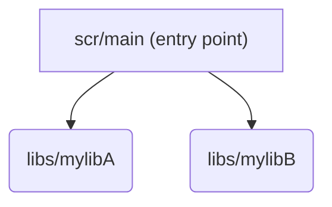

> This project is a simple example of how to link a static library manually using Mingw.

## Program dependencies




## Windows Guide

In order to compile the project, you need to have Mingw installed on your machine.

#### 1 - Create an object file from the lib source:
```batch
g++ -c mylibA.cpp -o mylibA.o
```
#### 2 - Create a static library from the generated object using:
```batch
ar rcs libmylibA.a mylibA.o
```
#### 3 - Repeat the steps 1 and 2 for the other lib (mylibB)
#### 4 - Compile the main.cpp file using the static libraries using:
```batch
g++ main.cpp -o main.exe^
  -I../libs/mylibA^
  -I../libs/mylibB^
  -L../libs/mylibA -l:libmylibA.a^
  -L../libs/mylibB -l:libmylibB.a
```

`-I` flag is used to specify the include path necessary to find the header files. <br/>
`-L` flag is used to specify the library path necessary to find the static libraries. <br/>
`-l` flag is used to specify the library name. <br/>

#### 5 - Run the program:
```batch
main.exe
```

